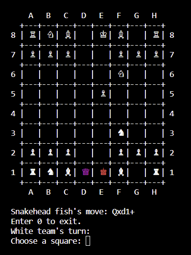

## Introduction
The main goal behind this engine was for me to learn more about C/C++ as well as chess. So far, the engine can search up to a depth of 10 in seconds and can rival engines that have ratings of 2500 or above. 

## Play against the engine
To compile the code, go to the src directory and use the provided make file command: <pre> $ <b>make all</b> </pre>
After the compilation process finishes, run the engine using the following command: <pre> $ <b>make start</b> </pre>

Before the game starts, the player is asked to choose a team by entering 1 for white and 2 for black.
<pre>
<b>Choose your team:
1. White
2. Black
0. Exit
Option:</b> </pre>

The GUI will be shown once an option is chosen:

To start a move, choose a piece to move by entering the file and the rank of the piece (e.g e2 or E2). After that the available moves for that piece will be shown as asterisks:

The player can choose one of these squares and yield the turn to the engine or they can choose to move another piece by entering 1.

When an opponent piece turns red, it means that the player can capture that piece.

When the player's king is in check, the king will turn red and the attackers' colors will be changed to purple.

## Features
1. Negamax Search Algorithm
2. Bitboard
3. Quiescence Search
4. Alpha-beta pruning
5. Null-move pruning
6. Late-move reductions
7. Extended Futility pruning
8. Transposition table
9. MVV-LVA
10. History Heuristic
11. Killer Move Heuristic
12. Iterative Deepening Search
13. In-check Extension
14. Aspiration Window
15. Principal Variation Search
16. Lazy SMP
17. Syzygy tablebase
18. Book opening tablebase
19. Base evaluation function
20. NNUE evaluation function

## Limitations
The engine is developed in a Linux environment, so it may not be compatible with devices that use other OS.